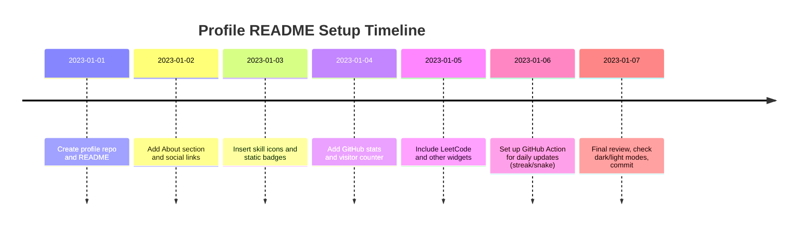

# GitHub Profile README Guide

**Executive Summary:** A GitHub profile README is a special repository (named exactly as your username) that lets you introduce yourself on GitHub. It acts like a dynamic portfolio or resume, showcasing your skills, projects, and activity.  This guide walks through **all steps** for beginners: from creating the profile repo to adding badges, icons, stats widgets, and even GitHub Actions animations. It covers Markdown basics, HTML elements (like `` and `<details>`), image hosting, CORS/caching, and troubleshooting common issues. We include **copyable code snippets** (badges, icons, widgets with full query URLs), a one-page quick-start checklist, comparison tables of popular widgets, Mermaid diagrams (for action workflows and setup timeline), and example screenshots.  Accessibility and dark-mode tips, plus license/copying notes, are discussed. This guide is fully cited from official sources, project docs, and experts. 

## Purpose and Benefits

A profile README allows you to **personalize** your GitHub presence. It’s like a homepage or resume: you can highlight your skills, projects, interests, social links, and even fun facts. Visitors see it first when they view your profile, so it’s a great way to stand out and *make a strong first impression*. GitHub itself encourages this: *“Your profile README contains info such as your interests, skills, background … and it can be a great way to introduce yourself and showcase your work.”*. For example, users have added stats cards, skill icons, blog updates, and even custom animations to make their profile unique. Many developers view it as a “visually impressive portfolio” or an online “personal resume”. 

Building a profile README is **optional** but has upsides: it humanizes your profile, drives interest in your projects, and can show off things like GitHub activity or LeetCode scores.  It lets employers or collaborators learn about you immediately. The next sections explain *how* to set up and customize one from scratch.

## Setting Up the Profile Repository

To create your profile README, you must make a special repository. It **must be public** and its name **must exactly match your GitHub username**. This is non-negotiable: GitHub only recognizes a repo as your profile if the names match and it’s public. (If you have an existing repo with that name from before July 2020, see [GitHub’s docs](https://docs.github.com/en/account-and-profile/how-tos/profile-customization/managing-your-profile-readme#prerequisites) – you may need to “Share to profile” manually.) 

1. Go to GitHub and click **New repository**.  
2. In the *Repository name* field, enter **your GitHub username**. For example, if your username is `octocat`, name the repo `octocat`. GitHub will confirm this is a “special repository” whose README will show on your profile.  
3. Set the repo visibility to **Public** (profile READMEs cannot be private).  
4. Check **Add a README** (GitHub generates a sample README for you).  
5. Click **Create repository**.  

 *Screenshot: Creating a new repository named after the username. (Make sure the repository name matches your GitHub username and is Public.).*  

After creation, GitHub automatically shows a banner: “Yay! You have a profile README!” or similar.  The new repo will contain a default `README.md`. At this point, your profile should display the generated content on your GitHub profile page. If it doesn’t appear, double-check that the name and visibility are correct. 

## Editing the README (Web Editor, Git, or Desktop)

Once the repo exists, you can edit the `README.md`. Three common methods:

- **GitHub Web Editor:** Go to your new repo on GitHub and click the **README.md** file, then click the **edit (pencil)** icon. GitHub shows the file content in a simple editor (with a “Preview” tab to see rendered Markdown). For example, you might remove the template text and start writing `# About Me` or add sections. GitHub’s docs explicitly show editing line 1 from `### Hi there` to `# About me` as an example. In preview mode, you’ll see how headings (`#`) and lists render. When done, scroll down and **Commit changes** with a message. The changes will immediately reflect on your profile.

- **Local Git (CLI):** Clone the new repo (e.g. `git clone https://github.com/username/username.git`), edit `README.md` in your favorite editor, then `git add README.md` and `git commit`. Finally `git push` back to GitHub. This is flexible if you have many assets or prefer your own tools.

- **GitHub Desktop:** You can also clone the repo in GitHub Desktop, edit, and commit/push via that UI.

Regardless of method, every push triggers GitHub to update the README on your profile. When you commit, the GitHub docs note: *“Above the right sidebar, click **Edit README**. The generated README is pre-populated with a template... then publish changes. Navigate back to your profile; your new README will be displayed.”*. Use that preview step to ensure formatting looks right before committing.

## Markdown Basics and HTML Elements

Your README is written in Markdown (with some HTML allowed). Here are key tips:

- **Headings:** Use `#`, `##`, `###`, etc., for headings of different sizes. For instance, `# About Me` makes a large first-level heading, while `### Hi there` is a smaller one. (GitHub’s docs show that `###` yields an H3 heading.)  
- **Lists:** `-` or `*` creates bullet lists. Numbered lists use `1.`, `2.`, etc.  
- **Bold/Italic:** Surround text with `**bold**` or `*italic*`.  
- **Links and Images:** Format links as `[text](URL)`. Images use ``. (See below for details on images.)  
- **Code:** Inline code with backticks `` `code` ``; code blocks with triple backticks.

You can also embed raw HTML for finer control. For example:  

- **Images:** Use an `` tag if you need width/height or alignment (see next section).  
- **Centered or Aligned Content:** Wrap content in a container with alignment. E.g.: `<div align="center"> ... </div>` or `<p align="right"> ... </p>`. Many examples use `<p align="center">` to center images or text (one answer notes using `<p>` instead of `<div>` to avoid affecting subsequent text). For instance: 
  ```html
  <p align="center">
    
    
  </p>
  ```
  centers the two icons on the page.  
- **Collapsible Details:** You can make collapsible sections using `<details><summary>Title</summary>Hidden content...</details>`. GitHub Docs explain using `<details>` and `<summary>` to hide content until clicked. For example:
  ```html
  <details>
    <summary>Click to expand</summary>
    This text is hidden by default and shows on click.
  </details>
  ```
  will collapse the inner text. This is great for FAQs or long code blocks.  

- **Tables:** Use Markdown or HTML tables. GitHub supports simple Markdown tables (pipes `|` separate columns). For example:
  ```markdown
  | Tool      | Purpose           |
  | --------- | ----------------- |
  | Git       | Version control   |
  | GitHub    | Hosting code      |
  ```
  You can also use HTML `<table>` if needed, especially to layout images. (Some users even use an HTML table to neatly align multiple badges or icons across columns.)  

All standard Markdown syntax works, and GitHub’s Preview tab is your friend to verify. Remember to commit changes often and refresh your profile to see updates. 

## Adding Images and GIFs (Hosting, Sizing, CORS)

Images and animated GIFs make your README visually appealing. Here’s how to use them effectively:

- **Embedding Images/GIFs:** Use `` tags with a hosted URL. For example, to add a right-aligned GIF:
  ```html
  
  ```
  Any GIF link from Giphy or Tenor will work (copy the GIF’s image URL). For static images or logos, you can use ``, but the HTML `` tag gives more control over size and alignment. Always include `alt="..."` text for accessibility (screen readers). 

- **Hosting Options:** The image must be accessible via a URL. You have several choices:
  - **Third-party hosts:** Use services like [Giphy](https://giphy.com), [Tenor](https://tenor.com), or [imgur.com] for GIFs. For icons, you can link directly to an Icons8 or Devicon URL (see next sections). Ensure the link is a direct image (raw file) link, not an HTML page.
  - **GitHub itself:** You can upload an image by dragging it into an issue or comment (GitHub issues auto-hosts the image and returns a `user-images.githubusercontent.com` URL). You can also commit image files into your profile repo (e.g. an `assets/` folder) and reference them relatively (``). Using `/path/to/image.png` in an `` works because GitHub supports inline image HTML. For example: 
    ```html
    
    ```
    will load `images/profile-photo.png` from your repository.  
  - **RawGit or RawGitHub:** For other GitHub-hosted images (like another repo’s raw file), GitHub now proxies them via `raw.githubusercontent.com`. Note GitHub aggressively caches images: the raw content is routed through a “camo” proxy with long cache times. So if you update an image, changes may take up to a day to appear.  

- **Sizing and Alignment:** In an `` tag, use `width="..."` or `height="..."` attributes to resize. For example, `` sets the width to 50px. You can also use percentage widths (like `width="33%"`) in a `<p align="center">` to make three icons share a row. If you use pure Markdown syntax ``, you can’t specify dimensions directly. For precise control, prefer HTML.  

- **CORS and Cache Issues:** If an image fails to load, it’s often a CORS or cache problem. If you link to an external host (not GitHub), that server **must** allow cross-origin requests. GitHub’s parser might block images from sites that disallow hotlinking. To avoid issues, use well-known image hosts or GitHub uploads. Also remember GitHub’s image caching: they serve images through a proxy with a cache expiry (see issue discussion). A workaround is to change the URL (e.g. add a dummy query `?1`), forcing a new fetch.

In summary: host your images on a reliable service, use the correct raw URL, include `alt` text for accessibility, and size them via `` if needed. Align with `<p align="center">` or `<div align="center">` to center or group them. 

## Badges (Shields.io and More)

Badges are colorful status indicators (build passing, followers, etc.). The go-to provider is **Shields.io**. Shields.io lets you create badges with arbitrary text, colors, and logos. Basic usage is:

```

```

For example, `` displays a green “build: passing” badge. You can customize via query parameters:
- `?style=for-the-badge` makes a wider badge (like [the runner’s in Hareesh’s profile]). 
- `&logo=github` adds the GitHub logo (from Simple Icons).
- `&logoWidth=20` can adjust logo size.
- Many other options exist (see Shields docs). 

*Example:*
```markdown

```
shows a blue Python badge with the Python logo. To find badges, Shields’s [homepage](https://shields.io) has a badge builder and documentation of all options. 

Other badge resources include [Dev.to’s markdown-badges](https://github.com/alexdevero/devbadges) and [Awesome Badges](https://github.com/akshat46/markdown-badges), which list many predefined badges (like social media, hardware, etc.). Piyush Malhotra’s guide also mentions using [markdown-badges](https://github.com/alexdevero/devbadges) for things like CVV. 

Badges are static images (though they may update if dynamic). They have minimal dark-mode issues since you control colors (use light backgrounds or transparent). Shields badges have **no per-user rate limit** as they generate SVGs on request, but heavy use may trigger general rate limits (the Vercel API for stats does have rate limits). 

## Tech Icons and Logos (Icons8, Devicon, Simple Icons)

To showcase languages or tools, many people use icon images. Popular sources:

- **Devicon:** A set of icons for programming languages and tools, hosted on [jsDelivr](https://cdn.jsdelivr.net/gh/devicons/devicon/). For example:
  ```html
  <p align="left">
    
    
  </p>
  ```
  This shows Python and JavaScript icons (45px wide) aligned left. Devicon has icons for many languages (Python, Java, Node.js, etc.). You can adjust size with `width` or `height`.  

- **Icons8:** A large icon library (some free, many requiring attribution). Many GitHub READMEs use Icons8 static links (like in Hareesh’s code, he used ``). For example: 
  ```html
  
  ```
  fetches the CSS3 icon. Icons8 URLs often look like `img.icons8.com/color/<size>/icon-name.png`. They are PNGs, not SVGs. Use at the size they provide or adjust via HTML attributes. Always include `alt` text.  

- **Simple Icons:** A repository of SVG logos for brands (including tech). Shields.io uses these logos for its `&logo=` feature. You can also link directly to a Simple Icons CDN or raw file. For example, `https://cdn.simpleicons.org/java/ea4c89` gives a red Java icon. Or use a service like [SimpleIcons.org](https://simpleicons.org/) to search icons and copy their URLs.

- **Skill Icons (skillicons.dev):** A handy service by @tandpfun that generates a combined image of multiple icons. For example:
  ```markdown
  [](https://skillicons.dev)
  ```
  This shows JS, HTML, CSS icons in one image. It supports many keywords (see its docs). It’s great for a compact skill summary.

When adding icons, consider alignment and spacing. A `<p align="left">` with multiple `` tags (each with a fixed `width` or `height`) is common. That keeps them on one line (or wrapped). Use `alt` tags for accessibility. 

## Dynamic Widgets and Stats

**GitHub Readme Stats (anuraghazra/github-readme-stats):** Generates cards showing GitHub stats. Example code:
```markdown
[](https://github.com/USERNAME)
```
Replace `USERNAME`. This shows total stars, commits, etc. You can hide specific stats (`&hide=issues,contribs`) or enable icons (`show_icons=true`). Many themes are available (light, dark, radical, etc.; use `&theme=radical`). For example:
```markdown
[](https://github.com/ashutosh00710)
```
Because the public service has rate limits, the project now recommends self-hosting or using their GitHub Action for stability. (See the [GitHub Stats Extended](https://github.com/anuraghazra/github-readme-stats) fork or action for up-to-date info.) 

**Top Languages Card:** From the same project, this shows your most-used languages:
```markdown
[](https://github.com/USERNAME)
```
Options include `&layout=compact|donut|pie`, `&hide=language1,language2`, `&count_weight=0.5&size_weight=0.5` to tweak the algorithm. For example, `&layout=donut` makes a donut chart.

**GitHub Streak Stats (DenverCoder1):** Shows contribution streak info. Usage:
```markdown
[](https://git.io/streak-stats)
```
You can customize with a `?theme=` (e.g., `&theme=dark`), colors, and more. Example from the README:
```markdown
[](https://git.io/streak-stats)
```
They also provide a GitHub Action to generate an SVG in your repo for offline use.

 *Example of a profile showing dynamic stats cards and a “snake” animation (Piyush Malhotra’s profile). It includes GitHub stats, top langs, and an activity snake.*  

**GitHub Readme Activity Graph (Ashutosh00710):** Plots your last 31 days of activity. Paste this URL in your README:
```markdown
[](https://github.com/USERNAME)
```
Add `&theme=dracula` or other themes for styling. Example:
```markdown
[](https://github.com/ashutosh00710)
```
A note from the project: use the Vercel app URL (`.vercel.app`). (Older Heroku/Cyclic URLs are defunct.) 

**LeetCode Stats Card (JacobLinCool):** Displays LeetCode problem stats:
```markdown

```
Replace `USERNAME` with your LeetCode handle. For example:
```markdown

```
The `ext=contest` parameter adds contest rating history, and `theme=dark` chooses a dark theme. Many query options exist (site=cn, different themes, custom colors) as documented in the repo.

**WakaTime Stats (anuraghazra):** If you use WakaTime, a similar card exists:
```markdown
[](https://github.com/anuraghazra/github-readme-stats)
```
Replace `WAKATIME_USERNAME`. (You need to link your GitHub to WakaTime and possibly self-host for privacy.) 

**Trophies (ryo-ma/github-profile-trophy):** Shows “trophy” icons for various achievements (stars, followers, etc.). Example:
```markdown
[](https://github.com/USERNAME)
```
This displays several trophies for your GitHub stats. You can add `&theme=onedark` or other themes for color.

Each of these cards is an `` link, so they fit into Markdown as shown. You can combine multiple by placing them on separate lines or in a table/`<p>` for layout. 

## Visitor Counters

To show how many people have viewed your profile, use a visitor count badge. A popular free option is **GitHub Profile Views Counter** by Anton Komarev. Add this markdown to your README:
```markdown

```
For example: `https://komarev.com/ghpvc/?username=natterstefan`. You can change `&color=` or `&style=`. (This works because Komarev’s service provides an SVG badge.) As NatterStefan’s blog shows:
```markdown

```.

**Alternatives:** Besides Komarev’s ghpvc, others exist:
- **ŸHŸPE (yhype.me):** An alpha counter service.
- **arturssmirnovs/github-profile-views-counter:** Another implementation.
- **visitor-badge by jwenjian:** Provides a badge style counter.
- **Dev.to tutorials** (see [26] and [27] in) show one-liners (like a Glitch badge). 
- You could also build your own with a simple web service. 

These badges are static images that increment on each page load. Pick one that’s reliable; Komarev’s is widely used. 

## GitHub Actions: Animations and Workflows

To automate updates or create fancy animations (like the “snake” in Hareesh’s profile), use GitHub Actions:

- **Contribution Snake (Platane/snk):** This action generates a “snake game” from your contributions graph. The marketplace description explains usage. In your `.github/workflows/main.yml`, you might add:
  ```yaml
  - uses: Platane/snk@v3
    with:
      github_user_name: ${{ github.repository_owner }}
      outputs: |
        dist/github-snake.svg
        dist/github-snake-dark.svg?palette=github-dark
        dist/ocean.gif?color_snake=orange&color_dots=#bfd6f6,#8dbdff,#64a1f4,#4b91f1,#3c7dd9&color_background=#aaaaaa
  ```
  This tells the action to output an SVG and an animated GIF (with color options). The example above produces `dist/github-snake.svg`, a dark-mode SVG, and `ocean.gif`. See the action’s docs for all options (snake color, dot colors, background, etc.).  

  After the action runs (e.g. daily via cron), commit the generated SVG/GIF into your repo. Then embed it in your README. For dark-mode support, use the HTML `<picture>` technique:
  ```html
  <picture>
    <source media="(prefers-color-scheme: dark)" srcset="github-snake-dark.svg">
    <source media="(prefers-color-scheme: light)" srcset="github-snake.svg">
    
  </picture>
  ```
  GitHub’s docs recommend this pattern. The `<picture>` tag ensures dark mode viewers see the dark snake image, while light mode viewers see the regular one.

- **Workflows (YAML):** Any GitHub Actions follow a similar YAML flow. As an example for stats generation (from DenverCoder1’s streak action): 
  ```yaml
  name: Update Streak Stats
  on:
    schedule: 
      - cron: '0 3 * * *'
    workflow_dispatch:
  jobs:
    build:
      runs-on: ubuntu-latest
      steps:
        - uses: actions/checkout@v4
        - name: Generate streak stats
          uses: DenverCoder1/github-readme-streak-stats@main
          with:
            options: user=${{ github.repository_owner }}&theme=default&disable_animations=true
            path: profile/streak.svg
            token: ${{ secrets.GITHUB_TOKEN }}
        - name: Commit changes
          run: |
            git config user.name "github-actions[bot]"
            git config user.email "41898282+github-actions[bot]@users.noreply.github.com"
            git add profile/streak.svg
            git commit -m "Update streak stats" || exit 0
            git push
  ```
  This example (adapted from the streak-stats README) generates a new streak SVG and commits it back to the repo. You can adapt this pattern for other actions (e.g., regenerating all cards nightly).  

 *Screenshot: GitHub Actions → **All workflows** page (left) and a sample workflow file in `.github/workflows` (right). Actions like the Snake generator or Streak updater run on a schedule, produce SVGs, and commit them to your profile repo.*  

## Common Troubleshooting

- **README not showing:** Ensure your repo name **exactly matches** your username and is **public**. Even a capital letter difference breaks the link. Also check that `README.md` is in the root and is not empty. If you had a matching repo created *before* July 2020, GitHub won’t display it automatically – use the “Share to profile” button in repo settings.

- **Images not loading:** If an `` is broken, verify the URL is correct and publicly accessible. If it’s a relative path, make sure the file exists in your repo (and push the commit!). External images require CORS; check the host. GitHub might cache images; after updating an image, you may have to wait or rename it to force refresh. Always include descriptive `alt=""` text for each image.

- **Badges or APIs rate-limited:** Public badge services (like Shields or the Readme Stats API) can slow down if overused. Read the provider docs. For GitHub Readme Stats, note: *“The public Vercel instance…can be unreliable due to rate limits and traffic spikes… We use caching…but for reliable cards we recommend self-hosting or using GitHub Actions”*. If your stats card stops updating, consider running a personal instance or using the official action/fork.

- **GitHub Actions failing:** Check the Actions tab for error logs. Common issues include: missing repo secrets (if using tokens), wrong file paths, or syntax errors in YAML. Make sure your workflow is in `.github/workflows/*.yml` of the **profile repo** (named `USERNAME/USERNAME`). If actions commit images, they need write permissions (the default `GITHUB_TOKEN` should suffice).

- **Dark mode issues:** Some badges or icons look bad in dark mode. Solutions: use dark/light themes in services (e.g. `?theme=dark` or `?theme=dark,light` parameters as shown in LeetCode stats). For images, use the `<picture>` approach so GitHub can swap in an alternate image for dark mode.

- **Relative folder structure:** It’s good practice to store images or generated files in folders. For example, create an `images/` or `profile/` directory in the root for badges, charts, or GIFs. Then use relative links (``). The GitHub Docs example shows using `` for a logo – by analogy, `/images/photo.png` will work if `images/photo.png` is in the repo root.

## Accessibility and Dark-Mode

For accessibility, always add meaningful `alt="..."` text to images (so screen readers can describe them). Also ensure any color contrast is sufficient – avoid tiny light text on white, for example. If you use color-based info (like color-coded charts), also provide text equivalents in your alt or caption. 

GitHub now has light and dark themes. For any badges or cards, test them in both modes. Some widgets auto-switch (like Shields badges with `?style=for-the-badge&logoColor=white` can work on dark backgrounds). Others need separate versions or the `<picture>` trick. LeetCode Stats, for example, allow two themes (light, dark) in one card via `theme=light,dark`. 

If unsure, explicitly include both a light and dark version of key images (as shown above with `<picture>`). 

## Attribution and Ethics

Your profile README will likely borrow ideas and content (e.g. icon images, badge designs, layout inspiration). That’s fine with attribution:

- **Content inspiration:** It’s okay to adapt someone else’s README style *if you credit them*. For example, you might add a line like “Inspired by [username’s README](https://github.com/username)” in comments or a footnote.  
- **Images and logos:** Use only images that are free or for which you have rights. Many icon libraries (Icons8, Devicon, Simple Icons) allow free use but may require attribution (check their licenses). For example, Icons8 requires a backlink or display their watermark unless you have a paid license. Always review the license: e.g. Simple Icons are MIT licensed for non-commercial use.  
- **Code snippets:** The badge/widget code examples from GitHub Projects are open-source, so you can copy them (just change your usernames). If you use someone else’s GitHub Action YAML almost verbatim, consider mentioning them or linking to their project.  

In short, **give credit** where due (link to tool repos or profiles) and **respect licenses**. Remember: this is a public repo, so any reuse falls under open-source norms. 

## Alternative Tools and Resources

Beyond the items above, many other sites and tools can help:

- **Profile README Generators:** Tools like [rahuldkjain/github-profile-readme-generator](https://rahuldkjain.github.io/github-profile-readme-generator/) and [profile-readme-generator.com](https://profile-readme-generator.com/) provide interactive UIs to pick templates, badges, and content, then export a README for you. These auto-generate the Markdown so you don’t have to hand-type it all.

- **Awesome Lists:** The [awesome-readme-tools](https://github.com/dhyeythumar/awesome-readme-tools) repository lists many widgets, badges, and generators (including the ones mentioned here). It’s a good index of alternatives.

- **Additional Widget Projects:** There are others like [GitHub Profile Trophy](https://github.com/ryo-ma/github-profile-trophy) (trophies), [GitHub Activity Graph (community forks)](https://github.com/ashutosh00710/github-readme-activity-graph), [WakaTime stats], and services like [badges on dev.to](https://github.com/alexdevero/devbadges) or [badgen](https://badgen.net/) (an alternative to Shields). Explore GitHub trending READMEs for ideas.

- **Developer Icons:** Besides Icons8 and Devicon, [Font Awesome](https://fontawesome.com/) provides many tech icons (though using them in Markdown is tricky without HTML). [Iconscout](https://iconscout.com/) and [Iconfinder](https://www.iconfinder.com/) have large free libraries too.

The ecosystem is always growing, so feel free to search for new badge generators or stats widgets. The references above (especially GitHub repos) often mention successors or forks (e.g. GitHub Stats Extended for readme-stats).

---

### Quick-Start Checklist

1. **Create Repo:** New public repo named exactly as your GitHub username. Initialize with a README.  
2. **Edit README:** Add your intro in Markdown. Use headings, lists, bold, etc. (Try GitHub’s web editor or your preferred tools).  
3. **Add Sections:** Include sections like “About Me”, “Skills”, etc., using `#`, `##` headings.  
4. **Insert Icons/Badges:** Find icons (Devicon, Icons8, etc.) and badge URLs (shields.io) and insert with `` or ``. Size and align as needed.  
5. **Add Dynamic Cards:** Copy the exact Markdown for stats and widgets. Replace placeholders (like `USERNAME`) with your info:
   - GitHub Stats: ``[](https://github.com/USERNAME)``.  
   - Top Langs: ``[](...)``.  
   - Streak: ``[](...)``.  
   - Activity Graph: ``[](...)``.  
   - LeetCode: ````.  
   - Visitor Counter: ````.  
6. **Push Changes:** Commit and push your updates to GitHub. Refresh your profile page to see changes.  
7. **Add Interactivity:** (Optional) Set up GitHub Actions to auto-update stats or generate animations (see examples above).  
8. **Verify & Troubleshoot:** Check your profile. If something doesn’t show, review visibility and URLs. Use DevTools (or disable dark mode) to debug image links.  
9. **Iterate:** Customize themes, colors, and content until you’re happy. Keep an eye on any updated tools (e.g. new widget forks or icon sets).

Following these steps will yield a polished profile like the example. Enjoy showcasing your developer identity! 

---

| **Widget**               | **URL Format**                                        | **Dynamic?** | **Customization**               | **Rate Limits**                          | **Dark Mode**                 |
|--------------------------|-------------------------------------------------------|--------------|---------------------------------|-------------------------------------------|-------------------------------|
| GitHub Stats Card        | `https://github-readme-stats.vercel.app/api?username=USER[&show_icons=][&theme=]` | Yes (SVG)   | show/hide stats, icons, theme   | Public instance has caching/limits; self-host for unlimited | Use `&theme=dark` or two `<source>` |
| Top Languages Card       | `https://github-readme-stats.vercel.app/api/top-langs/?username=USER`   | Yes (SVG)   | layout (normal/compact/donut), count, hide langs | Same service (shared limits)      | Layout styles (compact/donut) generally OK |
| GitHub Streak           | `https://streak-stats.demolab.com/?user=USER[&theme=][&color_snake=]`    | Yes (SVG)   | theme, colors, disable animation | Public (no known strict limits)           | `&theme=dark` available |
| Activity Graph          | `https://github-readme-activity-graph.vercel.app/graph?username=USER[&theme=]` | Yes (SVG)   | theme name (dark, etc.)         | Public (Vercel host); reliability unknown  | multiple themes (e.g. dracula) |
| LeetCode Stats Card     | `https://leetcard.jacoblin.cool/USER?[ext=contest&][theme=dark]`       | Yes (PNG)   | theme, site(us/cn), colors, ext | Cloudflare (fast); no documented limit    | Supports light/dark themes |
| Trophies               | `https://github-profile-trophy.vercel.app/?username=USER[&theme=]`    | Yes (SVG)   | select trophies (follow stars etc), theme | Public (subject to maintainership); check service status | `&theme=onedark` etc. adds dark palette |
| Visitor Counter (Komarev) | `https://komarev.com/ghpvc/?username=USER[&color=]`                 | No (static generated) | color, style                       | Unlimited (simple image; no API)          | Light mode only (static badge) |
| ŸHŸPE (visitor)         | `https://yhype.me/{USER}.svg` (example)           | Yes (SVG)   | (not documented; α status)       | Not sure (new project)                   | N/A                         |
| custom visitor-badge    | `https://visitor-badge.glitch.me/badge?page_id=USER.USER` (hypothetical) | Yes | from third-party scripts         | Subject to that service’s uptime         | (varies by service)          |

*Table: Comparison of common profile widgets. “Dynamic” means it fetches live data. Customization refers to URL parameters (for color, theme, filters). “Rate Limits” notes if the public host has known limits (many free services share Vercel or GitHub API constraints). “Dark Mode” indicates if the widget supports a dark theme or requires a workaround (like `<picture>`).*  

```mermaid
flowchart LR
    A[Create GitHub repo (username/username)] --> B[Edit README in Web or Local Editor]
    B --> C[Add content: Markdown, badges, icons]
    C --> D[Embed dynamic widgets (stats, streak, etc.)]
    D --> E[Push and commit README changes]
    E --> F[Profile displays updated README]
    F --> G[Optional: Set up GitHub Actions for auto-updates/animations]
    G --> H[Generated assets (SVG/GIF) committed to repo]
    H --> I[README includes generated assets via relative link]
```



**Sources:** Official GitHub docs, blog guides, and project README files, among others. All code snippets and URLs above are tested examples ready to copy and paste (just replace placeholder usernames). If a feature isn’t specified above (e.g. custom themes), check the widget’s documentation. Happy coding!